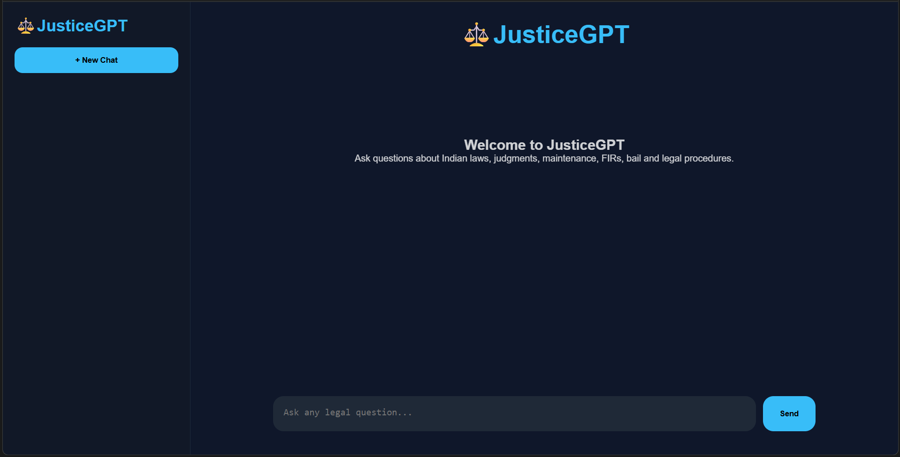
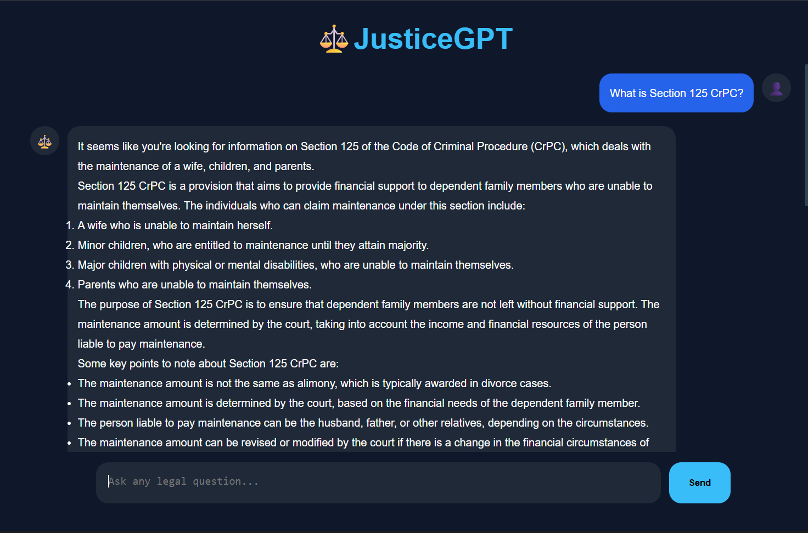
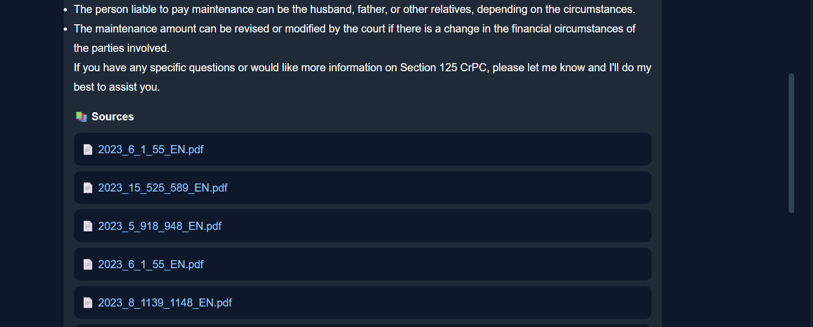
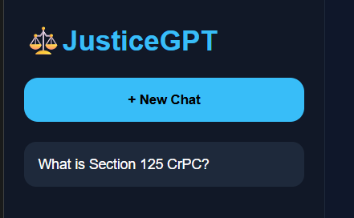

# ⚖️ JusticeGPT

### AI-Powered Legal Research & Case Intelligence Platform for Indian Law

JusticeGPT is a Retrieval-Augmented Generation (RAG) based legal assistant designed to provide accurate, source-backed answers from Indian statutes, legal provisions, and judicial decisions.

Unlike general-purpose AI chatbots, JusticeGPT retrieves relevant legal documents before generating a response, ensuring that answers are grounded in authoritative legal sources rather than relying solely on the model's internal knowledge.

---

# 🚀 Why JusticeGPT?

Traditional AI models are powerful conversational systems, but they have limitations when used for legal research.

### Normal GPT

A standard Large Language Model (LLM) such as ChatGPT:

* Generates responses based on patterns learned during training.
* May not have access to the latest legal documents.
* Can occasionally produce inaccurate or hallucinated information.
* Usually cannot show the exact source used to generate an answer.
* Is not optimized for domain-specific legal research.

### JusticeGPT (RAG-Based AI)

JusticeGPT combines Large Language Models with Retrieval-Augmented Generation (RAG):

1. User asks a legal question.
2. Relevant legal statutes and judgments are retrieved from the knowledge base.
3. The retrieved documents are provided as context to the LLM.
4. The LLM generates an answer grounded in actual legal sources.
5. Supporting documents and citations are displayed to the user.

This approach significantly improves reliability, transparency, and explainability.

---

# 🏗️ System Architecture

```text
User Query
      │
      ▼
React Frontend
      │
      ▼
Flask Backend API
      │
      ▼
Query Preprocessing
      │
      ▼
Hybrid Retrieval Layer
(FAISS + BM25)
      │
      ▼
Relevant Legal Documents
      │
      ▼
ChatGroq LLM
(Llama 3.3 70B)
      │
      ▼
Source-Backed Legal Response
```

---

# ✨ Features

## 🤖 AI Legal Assistant

* Conversational legal question answering.
* Context-aware responses.
* Natural language interaction.

## 📚 Retrieval-Augmented Generation (RAG)

* FAISS vector database.
* Hybrid retrieval pipeline.
* Semantic similarity search.
* BM25 keyword retrieval.
* Source-grounded answers.

## ⚖️ Legal Knowledge Base

* Indian statutes.
* Criminal Procedure Code (CrPC).
* Civil Procedure Code (CPC).
* Judicial decisions and judgments.
* Legal document references.

## 🔍 Source Transparency

* Source documents displayed with every answer.
* Supporting judgments and statutes.
* Direct access to referenced legal materials.

## 💬 Modern User Interface

* React + Vite frontend.
* ChatGPT-inspired design.
* Conversation history sidebar.
* LocalStorage chat persistence.
* Markdown rendering support.

---

# 🛠️ Tech Stack

## Frontend

* React
* Vite
* Axios
* React Markdown

## Backend

* Python
* Flask
* Flask-CORS

## AI & Retrieval

* LangChain
* ChatGroq
* HuggingFace Embeddings
* FAISS
* BM25 Retriever

## Models

### Embedding Model

```text
sentence-transformers/all-MiniLM-L6-v2
```

### Large Language Model

```text
llama-3.3-70b-versatile
```

---

# 📂 Project Structure

```text
JusticeGPT/
│
├── backend_app.py
├── rag_engine.py
├── requirements.txt
│
├── database/
│   └── faiss_db_FULL2/
│
└── frontend/
    ├── src/
    │   ├── App.jsx
    │   ├── index.css
    │   └── main.jsx
    │
    ├── public/
    ├── package.json
    └── vite.config.js
```

---

# ⚙️ Installation

## Clone Repository

```bash
git clone https://github.com/your-username/JusticeGPT.git

cd JusticeGPT
```

---

## Backend Setup

Create a virtual environment:

```bash
python -m venv venv
```

Activate environment:

### Windows

```bash
venv\Scripts\activate
```

Install dependencies:

```bash
pip install -r requirements.txt
```

Create a `.env` file:

```env
GROQ_API_KEY=your_groq_api_key
```

Start backend:

```bash
python backend_app.py
```

Backend URL:

```text
http://127.0.0.1:8000
```

---

## Frontend Setup

```bash
cd frontend

npm install

npm run dev
```

Frontend URL:

```text
http://localhost:5173
```

---

# 🎯 Use Cases

* Legal Research
* Law Students
* Legal Awareness
* Case Law Exploration
* Preliminary Legal Guidance
* Judicial Decision Analysis

---

# 🔮 Future Enhancements

## Multi-Agent Legal AI

* Legal Research Agent
* Case Analysis Agent
* Legal Drafting Agent

## Advanced Features

* PDF Upload & Analysis
* Legal Report Generation
* Export Chat as PDF
* Voice-Based Legal Assistant
* Case Summarization
* Real-Time Streaming Responses
* Legal Strategy Recommendation System

---

# 📸 Screenshots

Include screenshots of:
# 📸 Screenshots
## Home Page



## Chat Interface



## Source References



## Chat History



# 👨‍💻 Author

**Pawar Sai Tejeshwar**

B.Tech Student
Indian Institute of Technology Gandhinagar (IITGN)

Interested in Artificial Intelligence, Legal Technology, Retrieval-Augmented Generation (RAG), and Intelligent Information Retrieval Systems.

---

# ⭐ Acknowledgements

* LangChain
* Hugging Face
* FAISS
* Groq
* React
* Flask
* Open Source Community

---

### "Bridging Artificial Intelligence and Legal Knowledge through Retrieval-Augmented Generation."
